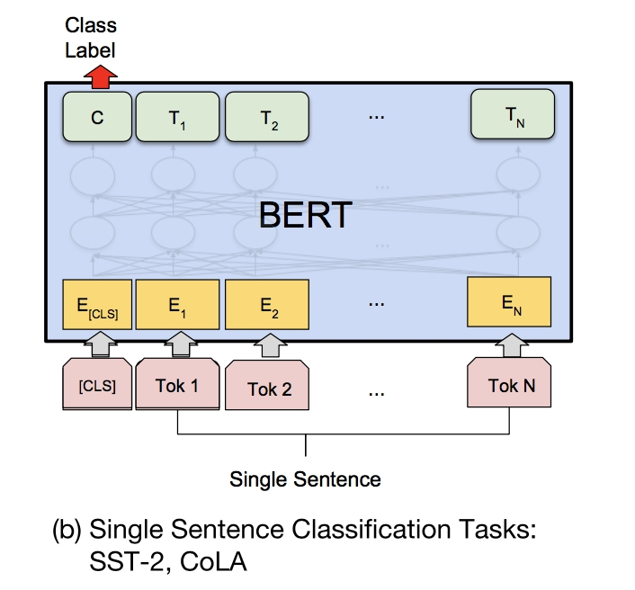
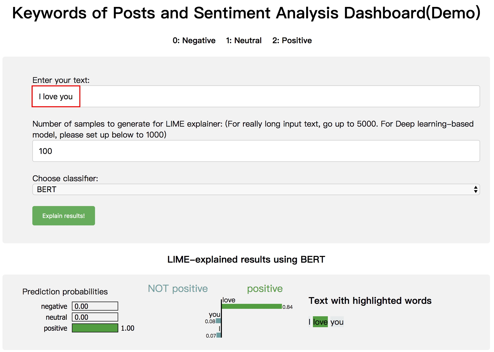
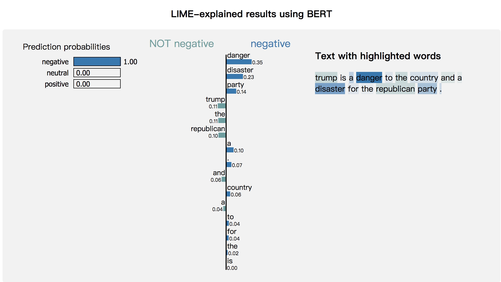

# twitter_real_time_sentiment_analysis
A web scraper of Twitter. Data Collection, and sentiment analysis

In this repo, we show how to scrape data from twiiter, and how to get labeled data for model training(sentiment analysis), and keywords extraction
to see how these model affect the model decision, do real-time sentemine analysis of tweet from 2020 US preseident candidate.

# Probelm Description

The problem is given a tweet from US president candidate in Twitter, to do sentiment analysis of the tweet. 
So, bascially it's a text multl-class(**negative, neutral, positive**) classifcation task.

# Methods

- Step1: Scrape all the tweets from 2020 US preseident candidate till 18 Dec 2020 as history data

- Step2: Lable the history data with positive and negative words(**please see asset dir**) to get **training data**.

- Step3: Fine-tune bert pre-trained language model with training data.

Noted:
Followed the **BERT Paper** suggested how to fine-tune single sentence classification with pre-trained language model.
The architecture looks like the below:



Fr more details, please see **data_tagging.py, train.py and model/bert_ssc.py**.

# Usage

Please run the below command line in order, if you wanna get demo result

* python 3.6.5+ environment

```sh
pip3 install -r requirements.txt
```

### Data Scraping

cd src/ (Please makue sure Makefile under current working diretory before running)

```sh
make get-trump
make get-walsh
make get-weld
...
```


### Data tagging

```sh
python data_tagging.py
```

### Training

```sh
make train
```
### Testing

```sh
python infer.py
```
## Service(Demo Example)
test sentence: I love you.


test sentence: trump is a danger to the country and a disaster for the republican party..

